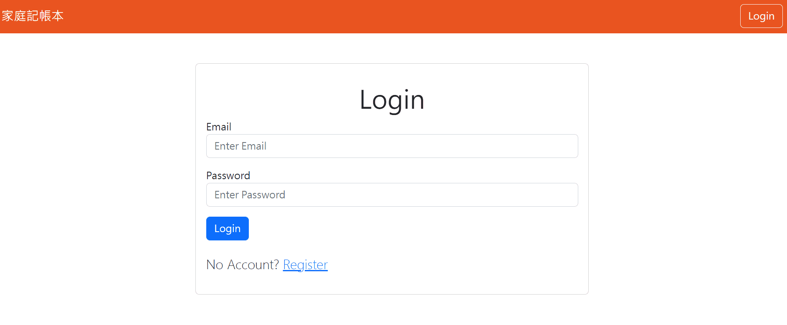

# Personal Expense Tracker
User need to loging to keep track of their expense.
<br>
Testing account:
<br>
* user1@example.com/ 1234
* user2@example.com/ 1234

### Prerequisites

Users need to get a local terminal software ready, for example, the Git Bash (for Windows).
* Node.js (@ 16.14.2)

### Installing

1. Open up your terminal to clone this project.

```
$ git clone (this app link)
```

2. Install dependencies

```
$ npm install
```

3. Create a .env file at root, refering to .env.example for more details.

### Usage

1. Run seeder to create restaurant data and users.
```
$ npn run seed
```

2.Type in followiwng command to activate router.

```
$ npn run dev
```

3. If the terminal shows the words below, that means you have successfully open the project.

```
The Express server is running on http://localhost:3000
mongodb connected!
```

4. Open up any web browser and type in "http://localhost:3000" to start to use.

## Contributor

> [Roger Huang](https://github.com/RogerHuang0320)
